# Plant Disease Detection on STM32: Edge Impulse vs. PyTorch Manual Pipeline

A comparative study of two end-to-end workflows for deploying a plant disease classification model on an STM32 microcontroller. The project explores how model architecture size, input image resolution, optimizer choice, and deployment toolchain affect accuracy, model size, and inference time on resource-constrained hardware.

## Table of Contents

- [Overview](#overview)
- [Dataset](#dataset)
- [Model Architectures](#model-architectures)
- [Training Experiments](#training-experiments)
  - [Edge Impulse Pipeline](#edge-impulse-pipeline)
  - [PyTorch Manual Pipeline](#pytorch-manual-pipeline)
- [Model Conversion & Quantization](#model-conversion--quantization)
- [Deployment on STM32](#deployment-on-stm32)
  - [Edge Impulse Deployment](#edge-impulse-deployment)
  - [STM32CubeAI Deployment](#stm32cubeai-deployment)
- [Results & Comparison](#results--comparison)
  - [Accuracy Comparison](#accuracy-comparison)
  - [Model Size Comparison](#model-size-comparison)
  - [Inference Time Comparison](#inference-time-comparison)
- [Key Takeaways](#key-takeaways)
- [How to Reproduce](#how-to-reproduce)
- [Tools & Technologies](#tools--technologies)

---

## Overview

Deploying machine learning models on microcontrollers is a growing field, but choosing the right workflow — and understanding the tradeoffs involved — is not straightforward. This project explores two distinct end-to-end paths for getting a plant disease classification model running on an STM32F407G-DISC1 board. Both paths are applied to the same problem — classifying 15 plant disease categories from the PlantVillage dataset — across multiple model architectures and input image resolutions (from 256×256 down to 16×16). The first uses Edge Impulse, a platform that automates the entire pipeline from training to deployment, producing a ready-to-flash .pack file. The second follows a manual route: training in PyTorch, converting through ONNX and TensorFlow to TFLite, quantizing, and deploying via STM32CubeAI.

The goal is to systematically compare how accuracy, model size, and inference time change across these two workflows as the neural network architecture shrinks and the input resolution drops. The project also examines the effect of optimizer choice (SGD vs. Adam) on the PyTorch side. By covering a wide range of configurations, this study provides a practical reference for anyone deciding between an automated tool like Edge Impulse and a hands-on manual pipeline for deploying ML on resource-constrained hardware.

## Dataset

**PlantVillage** — [Kaggle Link](https://www.kaggle.com/datasets/emmarex/plantdisease)

- **Total Images:** 20,638
- **Classes:** 15 (plant disease categories)
- **Original Resolution:** 256×256 RGB

| Class | Samples |
|-------|---------|
| Tomato — Yellow Leaf Curl Virus | 3,208 |
| Tomato — Bacterial Spot | 2,127 |
| Tomato — Late Blight | 1,909 |
| Tomato — Septoria Leaf Spot | 1,771 |
| Tomato — Spider Mites (Two-spotted) | 1,676 |
| Tomato — Healthy | 1,591 |
| Pepper (Bell) — Healthy | 1,478 |
| Tomato — Target Spot | 1,404 |
| Potato — Early Blight | 1,000 |
| Potato — Late Blight | 1,000 |
| Tomato — Early Blight | 1,000 |
| Pepper (Bell) — Bacterial Spot | 997 |
| Tomato — Leaf Mold | 952 |
| Tomato — Mosaic Virus | 373 |
| Potato — Healthy | 152 |

**Data Split:** 80% training, 10% validation, 10% test.

## Model Architectures

Both pipelines use custom CNN architectures designed from scratch (no transfer learning). The architectures are intentionally different between the two pipelines — the goal is not a one-to-one comparison of identical models, but rather to explore how each workflow performs with its own "big" and "small" network variant across different input resolutions.

### Edge Impulse Architectures

#### EI "Big" (used for 256×256, 128×128, 64×64)

| Layer | Details |
|-------|---------|
| Input | H × W × 3 (RGB) |
| 2D Conv / Pool | 16 filters, 3×3 kernel |
| 2D Conv / Pool | 32 filters, 3×3 kernel |
| 2D Conv / Pool | 64 filters, 3×3 kernel |
| Flatten | — |
| Dropout | rate 0.25 |
| Dense | 128 neurons |
| Dense | 64 neurons |
| Dense | 32 neurons |
| Output | 15 classes |

#### EI "Small" (used for 32×32, 16×16)

| Layer | Details |
|-------|---------|
| Input | H × W × 3 (RGB) |
| 2D Conv / Pool | 16 filters, 3×3 kernel |
| 2D Conv / Pool | 32 filters, 3×3 kernel |
| Flatten | — |
| Dropout | rate 0.25 |
| Output | 15 classes |

> **Note:** Edge Impulse applies int8 quantization automatically during profiling. For every created Impulse both the Unoptimized(float32) and the Optimized(int8) are available. Edge Impulse gives also an estimate of inference time, ram usage and flash usage for the device of deployment.

### PyTorch Architectures

#### PyTorch "Big" — `Plants` (used for 64×64, 32×32, 16×16)

| Layer | Output Shape | Parameters |
|-------|-------------|------------|
| Conv2d (3→16, 3×3) + MaxPool2d (2×2) + LeakyReLU | 16 × H/2 × W/2 | 448 |
| Conv2d (16→32, 3×3) + MaxPool2d (2×2) + LeakyReLU | 32 × H/4 × W/4 | 4,640 |
| Conv2d (32→64, 3×3) + MaxPool2d (2×2) + LeakyReLU | 64 × H/8 × W/8 | 18,496 |
| Conv2d (64→128, 3×3) + MaxPool2d (2×2) + LeakyReLU | 128 × H/16 × W/16 | 73,856 |
| Flatten + Dropout (0.25) | — | — |
| Linear → 256 + LeakyReLU | 256 | varies by input size |
| Linear → 128 + LeakyReLU | 128 | 32,896 |
| Linear → 64 + LeakyReLU | 64 | 8,256 |
| Linear → 15 (output) | 15 | 975 |

#### PyTorch "Small" — `Plants_Small` (used for 64×64, 32×32, 16×16)

| Layer | Output Shape | Parameters |
|-------|-------------|------------|
| Conv2d (3→16, 3×3) + MaxPool2d (2×2) + LeakyReLU | 16 × H/2 × W/2 | 448 |
| Conv2d (16→32, 3×3) + MaxPool2d (2×2) + LeakyReLU | 32 × H/4 × W/4 | 4,640 |
| Flatten + Dropout (0.25) | — | — |
| Linear → 32 | 32 | varies by input size |
| Linear → 15 (output) | 15 | 495 |

### Key Differences Between Pipelines

| Aspect | Edge Impulse | PyTorch |
|--------|-------------|---------|
| Big model conv layers | 3 (16→32→64) | 4 (16→32→64→128) |
| Big model dense layers | 128→64→32 | 256→128→64 |
| Small model dense layers | None (conv → output directly) | 32 (one hidden dense layer) |
| Activation | Managed by Edge Impulse | LeakyReLU |
| Quantization | Automatic (int8) | Manual (PyTorch → ONNX → TF → TFLite) |

<!-- Add total parameter counts for each architecture at each input resolution -->

## Training Experiments

### Edge Impulse Pipeline

All models were trained through the Edge Impulse Studio web interface.

| # | Architecture | Input Size | Training Accuracy and Loss| Test Accuracy | Notes |
|---|-------------|-----------|-----------|----------|-------|
| 1 | EI Big | 256×256 | 86.5% - 0.6 | 82.95% | Doesn't fit on STM32 |
| 2 | EI Big | 128×128 | 93.1% - 0.3 | 91.83% | Doesn't fit on STM32|
| 3 | EI Big | 64×64 | 94.6% - 0.55 | 92.92% | Fits on STM32 |
| 4 | EI Small | 32×32 | 91.8% - 0.34 | 89.43% | Fits on STM32 |
| 5 | EI Small | 16×16 | 88.9% - 0.32 | 82.61% | Fits on STM32 |

### PyTorch Manual Pipeline

All models were trained locally using PyTorch. Each configuration was trained with both SGD and Adam optimizers.

**Training Hyperparameters:**
- Learning Rate: 
- Batch Size: 16
- Epochs: 100
- Loss Function: CrossEntropyLoss
- Train/Val/Test Split: 80% training, 10% validation, 10% test

| # | Architecture | Input Size | Learning Rate | Optimizer | Test Loss | Test Acc | Inference Time(sec) |
|---|-------------|-----------|-----------|-----------|-----------|---------|----------|
| 1 | Big | 64×64 | 5e-3 | SGD | 0.0099 | 97.97 | 0.0044 |
| 2 | Big | 64×64 | 1e-3 | Adam | 0.0094 | 98.4 | 0.0052 |
| 3 | Big | 32×32 | 5e-3 | SGD | 0.012 | 97.43 | 0.0019 |
| 4 | Big | 32×32 | 1e-3 | Adam | 0.0153 | 97.04 | 0.0016 |
| 5 | Big | 16×16 | 5e-3 | SGD | 0.3489 | 7.46 | 0.0009 |
| 6 | Big | 16×16 | 1e-3 | Adam | 0.0332 | 93.85 | 0.0008 |
| 7 | Small | 64×64 | 5e-3 | SGD | 0.0318 | 91.96 | 0.0039 |
| 8 | Small | 64×64 | 1e-3 | Adam | 0.0282 | 97.24 | 0.004 |
| 9 | Small | 32×32 | 5e-3 | SGD | 0.0216 | 94.82 | 0.0011 |
| 10 | Small | 32×32 | 1e-3 | Adam | 0.0192 | 96.85 | 0.001 |
| 11 | Small | 16×16 | 5e-3 | SGD | 0.0401 | 88.95 | 0.0006 |
| 12 | Small | 16×16 | 1e-3 | Adam | 0.0288 | 93.12 | 0.0006 |

**Training Curves:**

#### Big Architecture — 64×64 — SGD
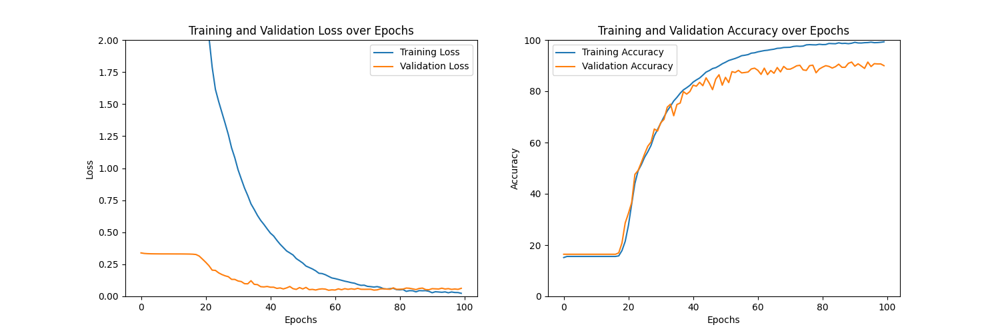

#### Big Architecture — 64×64 — Adam
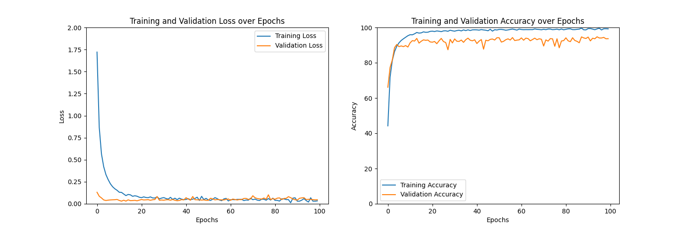

#### Big Architecture — 32x32 — SGD
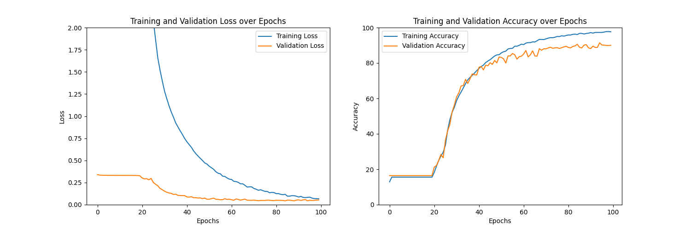

#### Big Architecture — 32x32 — Adam
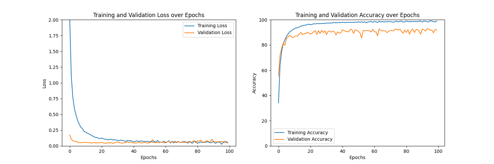

#### Big Architecture — 16x16 — SGD
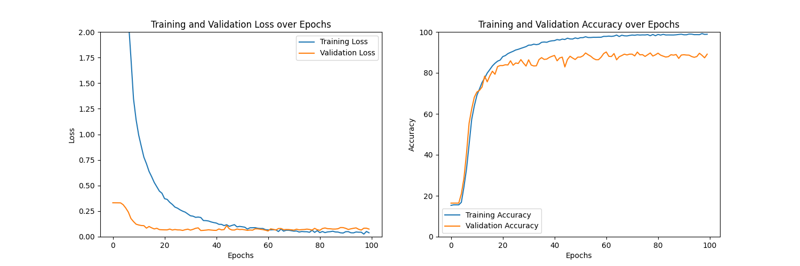

#### Big Architecture — 16x16 — Adam
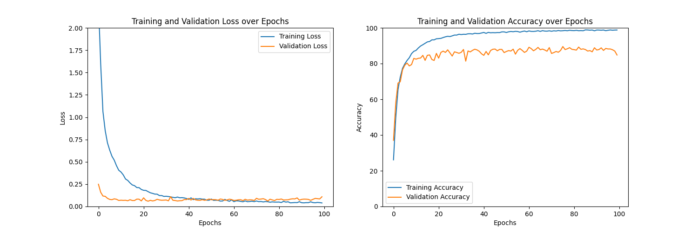

#### Small Architecture — 64×64 — SGD
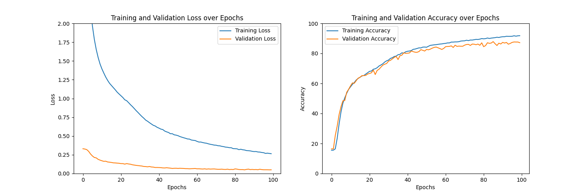

#### Small Architecture — 64×64 — Adam
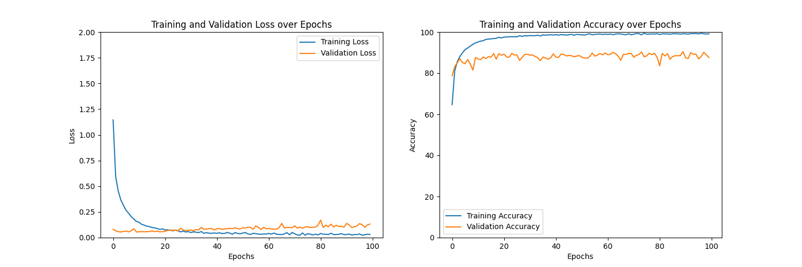

#### Small Architecture — 32x32 — SGD
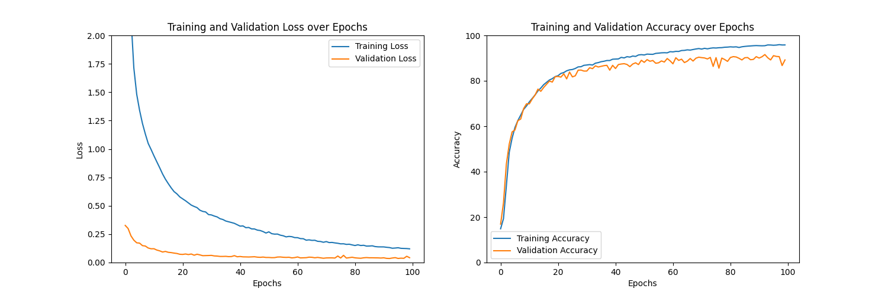

#### Small Architecture — 32x32 — Adam
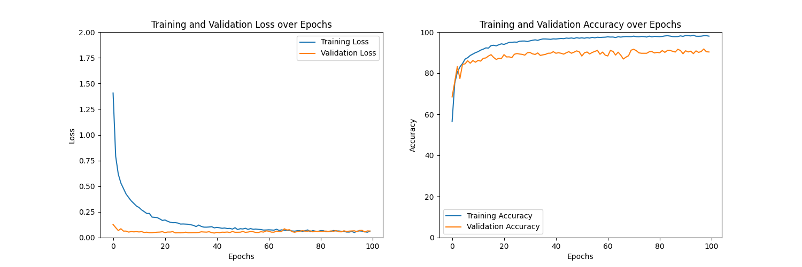

#### Small Architecture — 16x16 — SGD
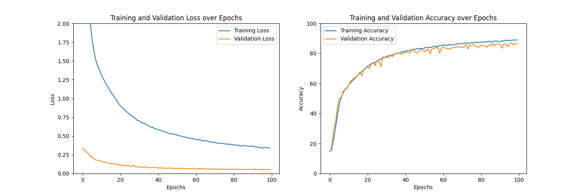

#### Small Architecture — 16x16 — Adam
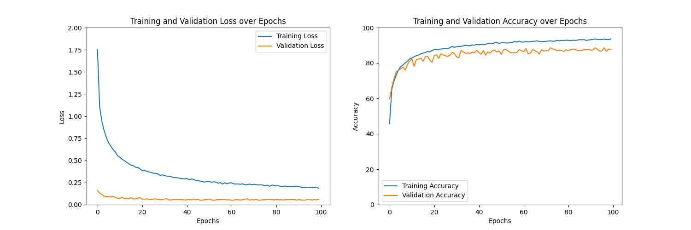

## Model Conversion & Quantization

### Edge Impulse Path
Edge Impulse handles conversion and quantization automatically, producing a `.pack` file ready for the STM32 board.

In Edge Impulse, deployment starts from the Deployment page in the Studio. You first select your deployment target — in this case, Cube.MX CMSIS-PACK, which packages the entire impulse (signal processing blocks, model weights, and inference code) into a single .pack file compatible with STM32CubeIDE. 

Before building, you choose between two inference engines: the EON Compiler or TFLite Micro. The EON Compiler translates the neural network directly into optimized C++ source code, eliminating the TFLite interpreter overhead and typically reducing RAM usage by 25–55% and flash by up to 35% compared to TFLite Micro, with no loss in accuracy. On Cortex-M4F targets like the STM32F407G, it also automatically leverages CMSIS-NN kernels for accelerated inference. You can also select whether to deploy the quantized int8 or the unquantized float32 version of the model. 

Once you click Build, Edge Impulse compiles everything server-side and provides a .pack file for download. This file is then imported into STM32CubeIDE via the CMSIS-PACK manager, after which inference can be invoked with a single function call (run_classifier), and results — including per-class probabilities and timing breakdowns for DSP and classification — are available immediately.

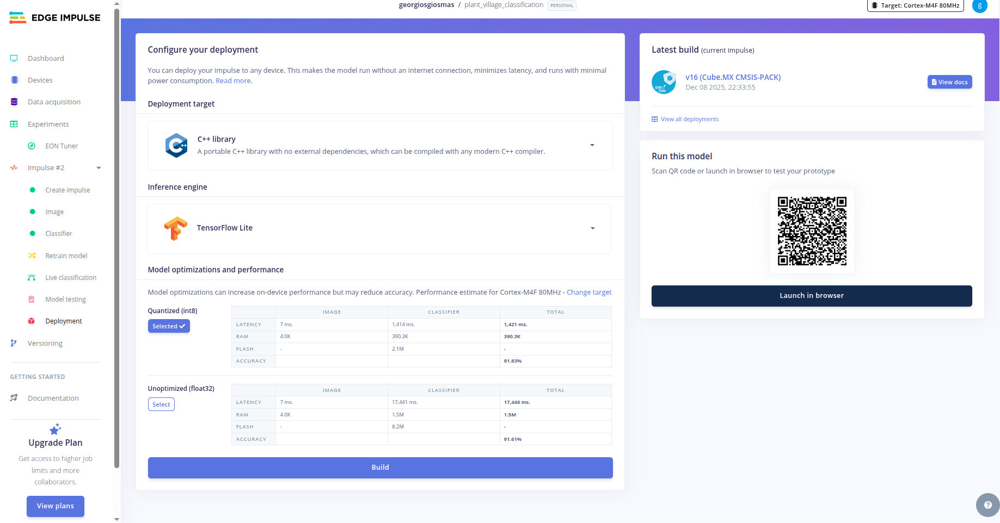

### PyTorch Manual Path

The manual conversion pipeline follows these steps:

```
PyTorch (.pt) → ONNX (.onnx) → TensorFlow (SavedModel) → TFLite (.tflite) → STM32CubeAI
```

<!-- 
    For each step, describe:
    1. PyTorch → ONNX: torch.onnx.export with opset_version=13
    2. ONNX → TensorFlow: onnx-tf (onnx_tf.backend.prepare)
    3. TensorFlow → TFLite: tf.lite.TFLiteConverter with full integer quantization
       - Mention the representative_dataset requirement
       - Mention the int8 quantization for MCU compatibility
    4. TFLite → STM32CubeAI: validation, code generation, integration
    
    Note the challenges encountered (e.g., the inference_input_type error and how it was resolved).
-->

**Quantization Details:**

<!-- 
    Explain:
    - Why quantization is necessary (MCU memory constraints, no FPU or slow FPU)
    - Post-training quantization approach used
    - Representative dataset size and how it was generated
    - Resulting model sizes before and after quantization
-->

| Model | Pre-Quantization Size | Post-Quantization Size | Size Reduction |
|-------|----------------------|----------------------|----------------|
| <!-- fill for each model that was converted --> | | | |

## Deployment on STM32

**Target Board:** STM32F407G-DISC1

<!-- 
    Briefly describe:
    - Board specifications (Flash, RAM, CPU frequency, FPU availability)
    - Why this board was chosen
-->

### Edge Impulse Deployment

<!-- 
    Describe:
    - How the .pack file was loaded onto the board
    - The inference setup (what input was used, how images were fed)
    - Inference time results per model
-->

| Model | Edge Impulse Predicted Inference Time | Actual Inference Time | RAM Usage | Flash Usage |
|-------|--------------------------------------|----------------------|-----------|-------------|
| Small 32×32 | <!-- fill --> | <!-- fill --> | <!-- fill --> | <!-- fill --> |
| Small 16×16 | <!-- fill --> | <!-- fill --> | <!-- fill --> | <!-- fill --> |

### STM32CubeAI Deployment

<!-- 
    Describe:
    - How STM32CubeAI was used to validate and generate code from .tflite
    - The integration process into an STM32 project
    - Inference time results per model
-->

| Model | STM32CubeAI Estimated Inference Time | Actual Inference Time | RAM Usage | Flash Usage |
|-------|-------------------------------------|----------------------|-----------|-------------|
| <!-- fill for each model deployed --> | | | | |

## Results & Comparison

### Accuracy Comparison

<!-- 
    A summary table or chart comparing accuracy across:
    - Input sizes (256→128→64→32→16)
    - Architectures (Big vs Small)
    - Optimizers (SGD vs Adam, for PyTorch models)
    - Pipelines (Edge Impulse vs PyTorch)
    
    Key insight: smaller input sizes and architectures maintained accuracy.
-->

### Model Size Comparison

<!-- 
    Compare the final deployed model sizes from both pipelines.
    Note which models fit on the STM32 and which don't.
-->

### Inference Time Comparison

<!-- 
    Compare inference times:
    - Edge Impulse predicted vs actual
    - STM32CubeAI estimated vs actual
    - Edge Impulse deployed vs STM32CubeAI deployed (for same architecture/input size)
-->

## Key Takeaways

<!-- 
    Summarize what you learned:
    1. Smaller models (32×32, 16×16 input) maintained accuracy while fitting on the MCU.
    2. Edge Impulse provides a faster, more streamlined deployment path.
    3. The manual PyTorch pipeline offers more control but involves a fragile multi-step conversion.
    4. Quantization is essential for MCU deployment — full int8 quantization significantly reduces model size.
    5. Adam vs SGD: which performed better at smaller resolutions?
    6. Any surprises in inference time differences between the two deployment paths.
-->

## How to Reproduce

### Prerequisites
- Python 3.10+
- PyTorch
- Edge Impulse CLI (for Edge Impulse path)
- STM32CubeAI (for manual path)
- STM32CubeMX / STM32CubeIDE

### Steps

```bash
# Clone the repository
git clone https://github.com/<your-username>/<repo-name>.git
cd <repo-name>

# Install Python dependencies
pip install -r requirements.txt

# Run the Jupyter Notebook for PyTorch training
jupyter notebook main.ipynb
```

<!-- 
    Add more detailed instructions for:
    - Setting up Edge Impulse project
    - Running STM32CubeAI validation
    - Flashing the board
-->

## Tools & Technologies

- **ML Frameworks:** PyTorch, TensorFlow/TFLite
- **Deployment Tools:** Edge Impulse, STM32CubeAI
- **Hardware:** STM32 STM32F407G-DISC1
- **Languages:** Python, C
- **Other:** ONNX, onnx-tf, Jupyter Notebook

## Repository Structure

```
├── README.md
├── main.ipynb                          # PyTorch training notebook
├── requirements.txt
├── edge_impulse/
│   ├── models/                         # .pack files and Edge Impulse exports
│   └── results/                        # Screenshots, accuracy/loss data
├── pytorch/
│   ├── models/                         # Saved .pt model files
│   ├── results/                        # Training curves for all 12 configurations
│   │   ├── big_64x64_sgd/
│   │   ├── big_64x64_adam/
│   │   ├── big_32x32_sgd/
│   │   ├── ...
│   │   └── small_16x16_adam/
│   └── converted/                      # ONNX, TF SavedModel, and TFLite files
├── stm32/
│   ├── edge_impulse_deployment/        # Edge Impulse firmware project
│   └── cubeai_deployment/              # STM32CubeAI project
└── docs/
    └── comparison_tables/              # Final comparison data, charts
```

---

<!-- 
    OPTIONAL SECTIONS TO CONSIDER ADDING LATER:
    
    ## Future Work
    - Try transfer learning (MobileNetV2, EfficientNet-Lite) for higher accuracy
    - Test on different STM32 boards (e.g., STM32H7 with more RAM)
    - Add a camera module for real-time inference
    - Compare against other deployment frameworks (TFLite Micro directly, CMSIS-NN)
    
    ## References
    - PlantVillage dataset paper
    - Edge Impulse documentation
    - STM32CubeAI documentation
    - PyTorch to TFLite conversion guides
-->
