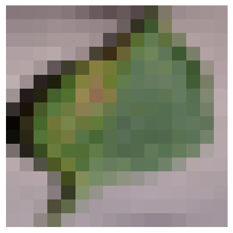
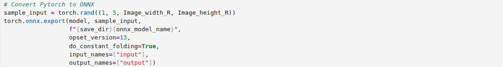
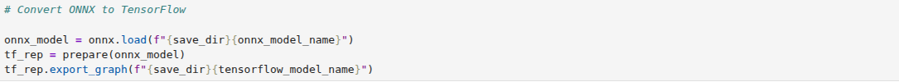
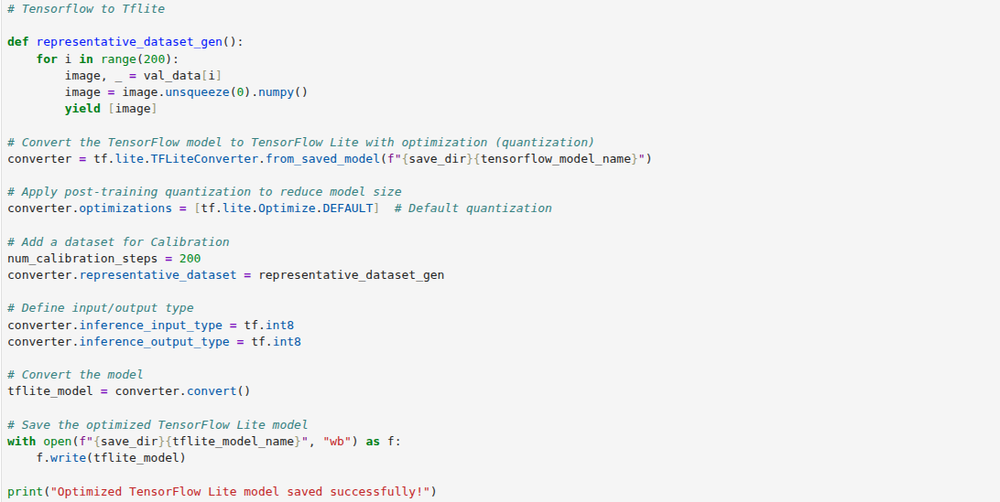

# Plant Disease Detection on STM32: Edge Impulse vs. PyTorch Manual Pipeline

A comparative study of two end-to-end workflows for deploying a plant disease classification model on an STM32 microcontroller. The project explores how model architecture size, input image resolution, optimizer choice, and deployment toolchain affect accuracy, model size, and inference time on resource-constrained hardware.

## Table of Contents

- [Overview](#overview)
- [Dataset](#dataset)
  - [Sample Images at Different Resolutions](#sample-images-at-different-resolutions)
- [Model Architectures](#model-architectures)
- [Training Experiments](#training-experiments)
  - [Edge Impulse Pipeline](#edge-impulse-pipeline)
  - [PyTorch Manual Pipeline](#pytorch-manual-pipeline)
- [Model Conversion & Quantization](#model-conversion--quantization)
- [Deployment on STM32](#deployment-on-stm32)
  - [Edge Impulse Deployment](#edge-impulse-deployment)
  - [STM32CubeAI Deployment](#stm32cubeai-deployment)
- [Results & Comparison](#results--comparison)
  - [Accuracy Comparison](#accuracy-comparison)
  - [Model Size Comparison](#model-size-comparison)
  - [Inference Time Comparison](#inference-time-comparison)
- [Key Takeaways](#key-takeaways)
- [Future Work](#future-work)
- [How to Reproduce](#how-to-reproduce)
- [Tools & Technologies](#tools--technologies)

---

## Overview

Deploying machine learning models on microcontrollers is a growing field, but choosing the right workflow — and understanding the tradeoffs involved — is not straightforward. This project explores two distinct end-to-end paths for getting a plant disease classification model running on an STM32F407G-DISC1 board. Both paths are applied to the same problem — classifying 15 plant disease categories from the PlantVillage dataset — across multiple model architectures and input image resolutions (from 256×256 down to 16×16). The first uses Edge Impulse, a platform that automates the entire pipeline from training to deployment, producing a ready-to-flash .pack file. The second follows a manual route: training in PyTorch, converting through ONNX and TensorFlow to TFLite, quantizing, and deploying via STM32CubeAI.

The goal is to systematically compare how accuracy, model size, and inference time change across these two workflows as the neural network architecture shrinks and the input resolution drops. The project also examines the effect of optimizer choice (SGD vs. Adam) on the PyTorch side. By covering a wide range of configurations, this study provides a practical reference for anyone deciding between an automated tool like Edge Impulse and a hands-on manual pipeline for deploying ML on resource-constrained hardware.

## Dataset

**PlantVillage** — [Kaggle Link](https://www.kaggle.com/datasets/emmarex/plantdisease)

- **Total Images:** 20,638
- **Classes:** 15 (plant disease categories)
- **Original Resolution:** 256×256 RGB

| Class | Samples |
|-------|---------|
| Tomato — Yellow Leaf Curl Virus | 3,208 |
| Tomato — Bacterial Spot | 2,127 |
| Tomato — Late Blight | 1,909 |
| Tomato — Septoria Leaf Spot | 1,771 |
| Tomato — Spider Mites (Two-spotted) | 1,676 |
| Tomato — Healthy | 1,591 |
| Pepper (Bell) — Healthy | 1,478 |
| Tomato — Target Spot | 1,404 |
| Potato — Early Blight | 1,000 |
| Potato — Late Blight | 1,000 |
| Tomato — Early Blight | 1,000 |
| Pepper (Bell) — Bacterial Spot | 997 |
| Tomato — Leaf Mold | 952 |
| Tomato — Mosaic Virus | 373 |
| Potato — Healthy | 152 |

**Data Split:** 80% training, 10% validation, 10% test.

### Sample Images at Different Resolutions

To illustrate the effect of downscaling on visual information, here are sample images from the dataset at each input resolution used in the experiments:

| 256×256 | 128×128 | 64×64 | 32×32 | 16×16 |
|---------|---------|-------|-------|-------|
|  |  |  |  |  |

<!-- 
    To generate these images, pick one sample from the dataset and resize it to each resolution.
    Save each as sample_256.png, sample_128.png, etc. in the images/ folder.
-->

At 32×32 and below, fine-grained visual details like leaf texture and spot patterns become difficult to distinguish by eye, yet the models still achieve strong classification accuracy — suggesting that the learned features rely more on color distribution and coarse shape patterns than on fine detail.

## Model Architectures

Both pipelines use custom CNN architectures designed from scratch (no transfer learning). The architectures are intentionally different between the two pipelines — the goal is not a one-to-one comparison of identical models, but rather to explore how each workflow performs with its own "big" and "small" network variant across different input resolutions.

### Edge Impulse Architectures

#### EI "Big" (used for 256×256, 128×128, 64×64)

| Layer | Details |
|-------|---------|
| Input | H × W × 3 (RGB) |
| 2D Conv / Pool | 16 filters, 3×3 kernel |
| 2D Conv / Pool | 32 filters, 3×3 kernel |
| 2D Conv / Pool | 64 filters, 3×3 kernel |
| Flatten | — |
| Dropout | rate 0.25 |
| Dense | 128 neurons |
| Dense | 64 neurons |
| Dense | 32 neurons |
| Output | 15 classes |

#### EI "Small" (used for 32×32, 16×16)

| Layer | Details |
|-------|---------|
| Input | H × W × 3 (RGB) |
| 2D Conv / Pool | 16 filters, 3×3 kernel |
| 2D Conv / Pool | 32 filters, 3×3 kernel |
| Flatten | — |
| Dropout | rate 0.25 |
| Output | 15 classes |

> **Note:** Edge Impulse applies int8 quantization automatically during profiling. For every created Impulse both the Unoptimized(float32) and the Optimized(int8) are available. Edge Impulse gives also an estimate of inference time, ram usage and flash usage for the device of deployment.

### PyTorch Architectures

#### PyTorch "Big" — `Plants` (used for 64×64, 32×32, 16×16)

| Layer | Output Shape | Parameters |
|-------|-------------|------------|
| Conv2d (3→16, 3×3) + MaxPool2d (2×2) + LeakyReLU | 16 × H/2 × W/2 | 448 |
| Conv2d (16→32, 3×3) + MaxPool2d (2×2) + LeakyReLU | 32 × H/4 × W/4 | 4,640 |
| Conv2d (32→64, 3×3) + MaxPool2d (2×2) + LeakyReLU | 64 × H/8 × W/8 | 18,496 |
| Conv2d (64→128, 3×3) + MaxPool2d (2×2) + LeakyReLU | 128 × H/16 × W/16 | 73,856 |
| Flatten + Dropout (0.25) | — | — |
| Linear → 256 + LeakyReLU | 256 | varies by input size |
| Linear → 128 + LeakyReLU | 128 | 32,896 |
| Linear → 64 + LeakyReLU | 64 | 8,256 |
| Linear → 15 (output) | 15 | 975 |

#### PyTorch "Small" — `Plants_Small` (used for 64×64, 32×32, 16×16)

| Layer | Output Shape | Parameters |
|-------|-------------|------------|
| Conv2d (3→16, 3×3) + MaxPool2d (2×2) + LeakyReLU | 16 × H/2 × W/2 | 448 |
| Conv2d (16→32, 3×3) + MaxPool2d (2×2) + LeakyReLU | 32 × H/4 × W/4 | 4,640 |
| Flatten + Dropout (0.25) | — | — |
| Linear → 32 | 32 | varies by input size |
| Linear → 15 (output) | 15 | 495 |

### Key Differences Between Pipelines

| Aspect | Edge Impulse | PyTorch |
|--------|-------------|---------|
| Big model conv layers | 3 (16→32→64) | 4 (16→32→64→128) |
| Big model dense layers | 128→64→32 | 256→128→64 |
| Small model dense layers | None (conv → output directly) | 32 (one hidden dense layer) |
| Activation | Managed by Edge Impulse | LeakyReLU |
| Quantization | Automatic (int8) | Manual (PyTorch → ONNX → TF → TFLite) |

## Training Experiments

### Edge Impulse Pipeline

All models were trained through the Edge Impulse Studio web interface.

| # | Architecture | Input Size | Training Accuracy and Loss| Test Accuracy | Notes |
|---|-------------|-----------|-----------|----------|-------|
| 1 | EI Big | 256×256 | 86.5% - 0.6 | 82.95% | Doesn't fit on STM32 |
| 2 | EI Big | 128×128 | 93.1% - 0.3 | 91.83% | Doesn't fit on STM32|
| 3 | EI Big | 64×64 | 94.6% - 0.55 | 92.92% | Fits on STM32 |
| 4 | EI Small | 32×32 | 91.8% - 0.34 | 89.43% | Fits on STM32 |
| 5 | EI Small | 16×16 | 88.9% - 0.32 | 82.61% | Fits on STM32 |

### PyTorch Manual Pipeline

All models were trained locally using PyTorch. Each configuration was trained with both SGD and Adam optimizers.

**Training Hyperparameters:**
- Learning Rate: 
- Batch Size: 16
- Epochs: 100
- Loss Function: CrossEntropyLoss
- Train/Val/Test Split: 80% training, 10% validation, 10% test

| # | Architecture | Input Size | Learning Rate | Optimizer | Test Loss | Test Acc | Inference Time(sec) |
|---|-------------|-----------|-----------|-----------|-----------|---------|----------|
| 1 | Big | 64×64 | 5e-3 | SGD | 0.0099 | 97.97 | 0.0044 |
| 2 | Big | 64×64 | 1e-3 | Adam | 0.0094 | 98.4 | 0.0052 |
| 3 | Big | 32×32 | 5e-3 | SGD | 0.012 | 97.43 | 0.0019 |
| 4 | Big | 32×32 | 1e-3 | Adam | 0.0153 | 97.04 | 0.0016 |
| 5 | Big | 16×16 | 5e-3 | SGD | 0.3489 | 7.46 | 0.0009 |
| 6 | Big | 16×16 | 1e-3 | Adam | 0.0332 | 93.85 | 0.0008 |
| 7 | Small | 64×64 | 5e-3 | SGD | 0.0318 | 91.96 | 0.0039 |
| 8 | Small | 64×64 | 1e-3 | Adam | 0.0282 | 97.24 | 0.004 |
| 9 | Small | 32×32 | 5e-3 | SGD | 0.0216 | 94.82 | 0.0011 |
| 10 | Small | 32×32 | 1e-3 | Adam | 0.0192 | 96.85 | 0.001 |
| 11 | Small | 16×16 | 5e-3 | SGD | 0.0401 | 88.95 | 0.0006 |
| 12 | Small | 16×16 | 1e-3 | Adam | 0.0288 | 93.12 | 0.0006 |

**Training Curves:**

#### Big Architecture — 64×64 — SGD


#### Big Architecture — 64×64 — Adam


#### Big Architecture — 32x32 — SGD


#### Big Architecture — 32x32 — Adam


#### Big Architecture — 16x16 — SGD


#### Big Architecture — 16x16 — Adam


#### Small Architecture — 64×64 — SGD


#### Small Architecture — 64×64 — Adam


#### Small Architecture — 32x32 — SGD


#### Small Architecture — 32x32 — Adam


#### Small Architecture — 16x16 — SGD


#### Small Architecture — 16x16 — Adam


## Model Conversion & Quantization

### Edge Impulse Path
Edge Impulse handles conversion and quantization automatically, producing a `.pack` file ready for the STM32 board.

In Edge Impulse, deployment starts from the Deployment page in the Studio. You first select your deployment target — in this case, Cube.MX CMSIS-PACK, which packages the entire impulse (signal processing blocks, model weights, and inference code) into a single .pack file compatible with STM32CubeIDE. 

Before building, you choose between two inference engines: the EON Compiler or TFLite Micro. The EON Compiler translates the neural network directly into optimized C++ source code, eliminating the TFLite interpreter overhead and typically reducing RAM usage by 25–55% and flash by up to 35% compared to TFLite Micro, with no loss in accuracy. On Cortex-M4F targets like the STM32F407G, it also automatically leverages CMSIS-NN kernels for accelerated inference. You can also select whether to deploy the quantized int8 or the unquantized float32 version of the model. 

Once you click Build, Edge Impulse compiles everything server-side and provides a .pack file for download. This file is then imported into STM32CubeIDE via the CMSIS-PACK manager, after which inference can be invoked with a single function call (run_classifier), and results — including per-class probabilities and timing breakdowns for DSP and classification — are available immediately.


### PyTorch Manual Path

The manual conversion pipeline follows these steps:

```
PyTorch (.pt) → ONNX (.onnx) → TensorFlow (SavedModel) → TFLite (.tflite) → STM32CubeAI
```

#### PyTorch → ONNX:


#### ONNX → TensorFlow:


#### TensorFlow → TfLite:


**Quantization Details:**

The STM32F407G features a Cortex-M4F with a single-precision FPU, but running float32 inference on an MCU is still significantly slower and more memory-intensive than int8 integer operations. More critically, the 1 MB of Flash and 192 KB of RAM on this board impose hard limits on model size — unquantized models simply do not fit in many cases.

Post-training quantization was applied using TensorFlow Lite's converter. The approach used is full integer quantization, where both weights and activations are quantized from float32 to int8. This requires a representative dataset to calibrate the quantization: a subset of 200 samples from the test set is fed through the model so the converter can measure the activation value ranges at each layer and compute appropriate scale/zero-point parameters for the int8 mapping.

The model's input and output types are also set to int8, meaning no float operations occur at any stage during inference — this is the configuration that STM32CubeAI is optimized for. The resulting size reduction is consistently around 70–75% across all model configurations:

| Model | Pre-Quantization Size | Post-Quantization Size | Size Reduction |
|-------|----------------------|----------------------|----------------|
| Big Architecture — 64x64 — SGD | 2.7 MB | 680.4 kB | 74.8% |
| Big Architecture — 64x64 — Adam | 2.7 MB | 680.4 kB | 74.8% |
| Big Architecture — 32x32 — SGD | 1.1 MB | 287.2 kB | 73.9% |
| Big Architecture — 32x32 — Adam | 1.1 MB | 287.2 kB | 73.9% |
| Big Architecture — 16x16 — SGD | 696.3 kB| 189 kB | 72.85% |
| Big Architecture — 16x16 — Adam | 696.3 kB| 189 kB | 72.85% |
| Small Architecture — 64x64 — SGD | 1.1 MB | 273.6 kB | 75.12% |
| Small Architecture — 64x64 — Adam | 1.1 MB | 273.6 kB | 75.12% |
| Small Architecture — 32x32 — SGD | 288.2 kB | 77 kB | 73.33% |
| Small Architecture — 32x32 — Adam | 288.2 kB | 77 kB | 73.33% |
| Small Architecture — 16x16 — SGD | 91.6 kB | 27.8 kB | 69.65% |
| Small Architecture — 16x16 — Adam | 91.6 kB | 27.8 kB | 69.65% |

## Deployment on STM32

> *Note on Build Configuration:* All inference time measurements on the STM32 were taken using the Release build configuration in STM32CubeIDE. In Debug mode, compiler optimizations are disabled (-O0 or -Og), which prevents the CMSIS-NN kernels from being properly optimized — meaning the int8 quantized models lose their speed advantage and run at nearly the same speed as the float32 versions. In Release mode, the compiler uses -O2 or -O3, enabling SIMD instructions (dual MAC operations on packed int8 values), loop unrolling, and function inlining — which is where the real performance gain of int8 quantization comes from on Cortex-M4F. For example, the EI Small 16x16 model returned 157ms in Debug but 20ms in Release, matching Edge Impulse's prediction exactly. Debug builds are useful for stepping through code, but their timing numbers are not meaningful for performance comparison.

**Target Board:** STM32F407G-DISC1

**To deploy each of the available .pack files on *STM32F407G-DISC1* follow the instructions provided on** —
[Deploy_PACK_file_on_STM](https://docs.edgeimpulse.com/hardware/deployments/run-cubemx)

### Edge Impulse Deployment

- int8

| Model | Edge Impulse Predicted Inference Time | Actual Inference Time | RAM Usage | Flash Usage |
|-------|--------------------------------------|----------------------|-------------|-----------|
| Big   64x64 | 334 ms | 496 ms | 85.3 kB | 577.4 kB |
| Small 32×32 | 64 ms | 79 ms | 22.8 kB | 64.4 kB |
| Small 16×16 | 19 ms | 20 ms | 7.8 kB| 41.9 kB | 


- float32

| Model | Edge Impulse Predicted Inference Time | Actual Inference Time | RAM Usage | Flash Usage |
|-------|--------------------------------------|----------------------|-------------|-----------|
| Small 32×32 | 687 ms | 1710 ms | 81.6 kB  | 161.6 kB |
| Small 16×16 | 190 ms | 398 ms | 21.6 kB | 71.6 kB | 


### STM32CubeAI Deployment

For the PyTorch models, the quantized .tflite files were imported into STM32CubeAI within STM32CubeIDE. STM32CubeAI generates optimized C inference code from the model, which is then integrated into a custom STM32 project. The input image data is preprocessed (normalized from uint8 0-255 to float 0.0-1.0, then quantized to int8 using the model's scale and zero-point parameters) and fed to the inference function. The output is an array of 15 int8 values (one per class), converted back to float using the output quantization parameters. The predicted class is the index with the highest value.

<!-- 
    Add screenshots here showing:
    - STM32CubeAI model import and analysis
    - STM32CubeIDE project configuration
    - Serial terminal output with inference results
    - Instructions on how to build and flash the project
-->

| Model | Inference Time | RAM Usage | Flash Usage |
|-------|-------------------------------------|----------------------|-----------|
| Big 64x64 SGD | 240 ms | 44.81 kB | 691.29 kB | 
| Big 64x64 Adam | 240 ms | 44.81 kB | 691.29 kB | 
| Big 32x32 SGD | 72 ms | 21.25 kB | 307.3 kB | 
| Big 32x32 Adam | 72 ms | 21.25 kB | 307.3 kB | 
| Big 16x16 SGD | 23 ms | 18.89 kB | 212.1 kB | 
| Big 16x16 Adam | 23 ms | 18.89 kB | 212.1 kB | 
| Small 64x64 SGD | 119 ms | 40.49 | 294.93 kB |  
| Small 64x64 Adam | 119 ms | 40.49 | 294.93 kB | 
| Small 32x32 SGD | 33 ms | 16.68 kB | 102.92 kB |
| Small 32x32 Adam | 32 ms | 16.68 kB | 102.92 kB | 
| Small 16x16 SGD | 9 ms |  12.55 kB | 54.92 kB | 
| Small 16x16 Adam | 9 ms | 12.55 kB | 54.92 kB | 

## Results & Comparison

### Accuracy Comparison

The PyTorch models consistently outperformed Edge Impulse models on test accuracy, likely due to the deeper architectures (4 conv layers vs 3 for Big, and an extra dense layer for Small) and the longer training regime (100 epochs locally vs Edge Impulse's cloud training).

| Input Size | EI Test Acc | PyTorch Best Test Acc | PyTorch Model | Optimizer |
|-----------|------------|----------------------|---------------|-----------|
| 64×64 | 92.92% | 98.40% | Big | Adam |
| 32×32 | 89.43% | 97.43% | Big | SGD |
| 16×16 | 82.61% | 93.85% | Big | Adam |

Adam consistently outperformed SGD on the PyTorch side, especially at lower resolutions. The most striking case is the Big 16×16 model: SGD achieved only 7.46% accuracy (essentially random), while Adam reached 93.85%. This suggests that at very low resolutions, the loss landscape becomes harder to navigate and SGD's fixed momentum gets stuck, while Adam's adaptive learning rate can still find good minima.

Even at 16×16 resolution — where images are barely recognizable to the human eye — both pipelines achieve over 80% accuracy, demonstrating that the models learn color and coarse shape patterns rather than fine texture details.

### Model Size Comparison

Quantization reduced the PyTorch model sizes by 70–75% consistently. The table below compares the final deployed model footprint (RAM + Flash) between the two pipelines for comparable configurations:

| Model | EI int8 RAM | EI int8 Flash | CubeAI RAM | CubeAI Flash |
|-------|------------|--------------|------------|-------------|
| Big 64×64 | 85.3 kB | 577.4 kB | 44.81 kB | 691.29 kB |
| Small 32×32 | 22.8 kB | 64.4 kB | 16.68 kB | 102.92 kB |
| Small 16×16 | 7.8 kB | 41.9 kB | 12.55 kB | 54.92 kB |

Edge Impulse models use less Flash in every case, which is expected since the EI architectures are shallower (fewer layers and parameters). The EI Small models also use less RAM due to having no hidden dense layers. Notably, the EI Big 64×64 model uses almost 2× the RAM of the CubeAI equivalent, despite having fewer conv layers — this is likely because Edge Impulse's EON Compiler and STM32CubeAI use different memory allocation strategies for intermediate activations.

The float32 Edge Impulse models are dramatically larger than their int8 counterparts: the Small 32×32 goes from 22.8 kB to 81.6 kB RAM and from 64.4 kB to 161.6 kB Flash — roughly 2.5–3.5× the footprint. The Big 64×64 float32 model doesn't even fit on the STM32, making quantization not just a speed optimization but a hard requirement for deployment.

### Inference Time Comparison

This is where the most significant differences emerge.

**Edge Impulse: float32 vs int8 (effect of quantization)**

| Model | float32 | int8 | Speedup |
|-------|---------|------|---------|
| Small 32×32 | 1710 ms | 79 ms | **21.6×** |
| Small 16×16 | 398 ms | 20 ms | **19.9×** |

The ~20× speedup from int8 quantization on Cortex-M4F is far beyond the typical 3–4× quoted for general hardware. This is because the Cortex-M4F's CMSIS-NN kernels use SIMD instructions to process four int8 values in a single 32-bit register, providing roughly 4× throughput from data packing alone, plus additional gains from the smaller memory footprint reducing data movement overhead.

**Edge Impulse vs STM32CubeAI (int8 — same board, different runtimes)**

| Model | EI int8 | CubeAI int8 | CubeAI Speedup |
|-------|---------|------------|----------------|
| Big 64×64 | 496 ms | 240 ms | **2.1×** |
| Small 32×32 | 79 ms | ~33 ms | **2.4×** |
| Small 16×16 | 20 ms | 9 ms | **2.2×** |

STM32CubeAI consistently runs inference approximately **2× faster** than Edge Impulse's EON Compiler on the same board with comparable int8 models. This is a significant finding. The reason is that STM32CubeAI is ST's own inference engine, optimized specifically for their silicon, while Edge Impulse's EON Compiler is a general-purpose tool that targets many different MCU families and cannot optimize as aggressively for any single chip.

**Edge Impulse predictions vs actual measurements**

Edge Impulse's inference time predictions were reasonably accurate for int8 models (within 1–1.5× of actual), but significantly underestimated for float32 models (actual was 2–2.5× slower than predicted). This suggests the prediction model is well-calibrated for the quantized CMSIS-NN path but less accurate for the float32 FPU path on this specific board.

## Key Takeaways

1. **Quantization is essential, not optional.** On the STM32F407G, int8 quantization provides a ~20× inference speedup over float32 and reduces model size by 70–75%. Some models don't fit on the board at all without quantization.

2. **STM32CubeAI runs 2× faster than Edge Impulse** on the same hardware with comparable models. ST's proprietary inference engine is more tightly optimized for their own silicon. This is the main performance advantage of the manual pipeline.

3. **Edge Impulse is dramatically easier to use.** The entire workflow — from training to deployment — takes minutes and requires no local toolchain setup, no dependency management, and no conversion pipeline. The PyTorch manual path requires Docker, pinned Python 3.10 dependencies, a fragile 4-step conversion chain (PyTorch → ONNX → TensorFlow → TFLite), and writing custom C code for the STM32 project.

4. **Adam outperforms SGD at low resolutions.** At 16×16, SGD completely failed on the Big architecture (7.46% accuracy) while Adam achieved 93.85%. At higher resolutions the gap narrows, but Adam was consistently better across all configurations.

5. **Smaller models maintain surprisingly high accuracy.** Even at 32×32 and 16×16 input resolution, both pipelines achieve 80–97% test accuracy on 15-class classification. The models appear to rely on color distribution and coarse shape patterns rather than fine visual details.

6. **The architectures are not identical across pipelines**, which means the comparison is between two complete workflows (including architecture design choices) rather than a controlled experiment isolating a single variable. This is intentional — it reflects how a real engineer would use each tool, designing the network within each platform's constraints.

## How to Reproduce

### PyTorch Pipeline (Docker — Recommended)

The PyTorch training and conversion pipeline relies on a very specific set of pinned package versions (Python 3.10, TensorFlow 2.10, onnx 1.12, onnx-tf 1.10) due to compatibility constraints in the ONNX-to-TensorFlow conversion chain. A Docker setup is provided to avoid dependency issues entirely.

#### Prerequisites

- [Docker](https://docs.docker.com/get-docker/) installed on your system

#### Installing Docker

**Linux (Ubuntu/Debian):**
```bash
sudo apt update
sudo apt install docker.io
sudo systemctl start docker
sudo systemctl enable docker

# Add your user to the docker group (avoids needing sudo)
sudo usermod -aG docker $USER
# Log out and back in for the group change to take effect
```

**Windows:**
1. Download and install [Docker Desktop for Windows](https://docs.docker.com/desktop/install/windows-install/)
2. During installation, ensure WSL 2 backend is selected
3. Restart your computer after installation
4. Open Docker Desktop and wait for it to start

**macOS:**
1. Download and install [Docker Desktop for Mac](https://docs.docker.com/desktop/install/mac-install/) (choose Apple Silicon or Intel depending on your Mac)
2. Open Docker Desktop and wait for it to start

#### Running the Notebook

```bash
# Clone the repository
git clone https://github.com/<your-username>/<repo-name>.git
cd <repo-name>

# Build the image and start the container
docker compose up --build
```

On the first run, this will build the Docker image with all pinned dependencies — this takes a few minutes. Subsequent runs reuse the cached image:

```bash
# Start without rebuilding
docker compose up
```

Once the container is running, open `http://localhost:8888` in your browser. Jupyter Notebook will be running with `main.ipynb` ready to use. All files (notebooks, trained models, results) are mounted from your local directory and persist after the container stops.

To stop the container:
```bash
docker compose down
```

> **Note on the dependency pinning:** The `onnx-tf` library (last release: v1.10.0, March 2022) is no longer maintained and only works with specific versions of `onnx` and `tensorflow`. The Docker setup exists precisely to encapsulate this fragile dependency chain — this is a real-world pain point that the Edge Impulse workflow avoids entirely, since it uses Keras/TensorFlow natively and never needs to cross framework boundaries.

### PyTorch Pipeline (Manual Installation)

If you prefer not to use Docker, you can install the dependencies directly. **Python 3.10 is required** — newer versions are not compatible with `onnx-tf`.

```bash
# Clone the repository
git clone https://github.com/<your-username>/<repo-name>.git
cd <repo-name>

# Create a virtual environment with Python 3.10
python3.10 -m venv venv
source venv/bin/activate  # Linux/macOS
# or: venv\Scripts\activate  # Windows

# Install pinned dependencies
pip install -r requirements.txt

# Run the Jupyter Notebook
jupyter notebook main.ipynb
```

### Edge Impulse Pipeline

The Edge Impulse models were trained through the [Edge Impulse Studio](https://studio.edgeimpulse.com/) web interface — no local installation is required for training and deployment.

### STM32 Deployment

- **Edge Impulse path:** Import the `.pack` file into STM32CubeIDE via the CMSIS-PACK manager
- **Manual path:** Import the `.tflite` file into STM32CubeAI within STM32CubeIDE
- Both require [STM32CubeIDE](https://www.st.com/en/development-tools/stm32cubeide.html)

<!-- 
    Add more detailed instructions for:
    - Running STM32CubeAI validation
    - Flashing the board
-->

## Tools & Technologies

- **ML Frameworks:** PyTorch, TensorFlow/TFLite
- **Deployment Tools:** Edge Impulse, STM32CubeAI
- **Hardware:** STM32F407G-DISC1
- **Languages:** Python, C
- **Other:** ONNX, onnx-tf, Docker, Jupyter Notebook

## Repository Structure

```
├── README.md
├── main.ipynb                          # PyTorch training notebook
├── requirements.txt                    # Pinned Python dependencies
├── Dockerfile                          # Docker image definition
├── docker-compose.yml                  # Docker Compose configuration
├── .dockerignore
├── edge_impulse/
│   ├── models/                         # .pack files and Edge Impulse exports
│   └── results/                        # Screenshots, accuracy/loss data
├── pytorch/
│   ├── models/                         # Saved .pt model files
│   ├── results/                        # Training curves for all 12 configurations
│   │   ├── big_64x64_sgd/
│   │   ├── big_64x64_adam/
│   │   ├── big_32x32_sgd/
│   │   ├── ...
│   │   └── small_16x16_adam/
│   └── converted/                      # ONNX, TF SavedModel, and TFLite files
├── stm32/
│   ├── edge_impulse_deployment/        # Edge Impulse firmware project
│   └── cubeai_deployment/              # STM32CubeAI project
└── docs/
    └── comparison_tables/              # Final comparison data, charts
```
